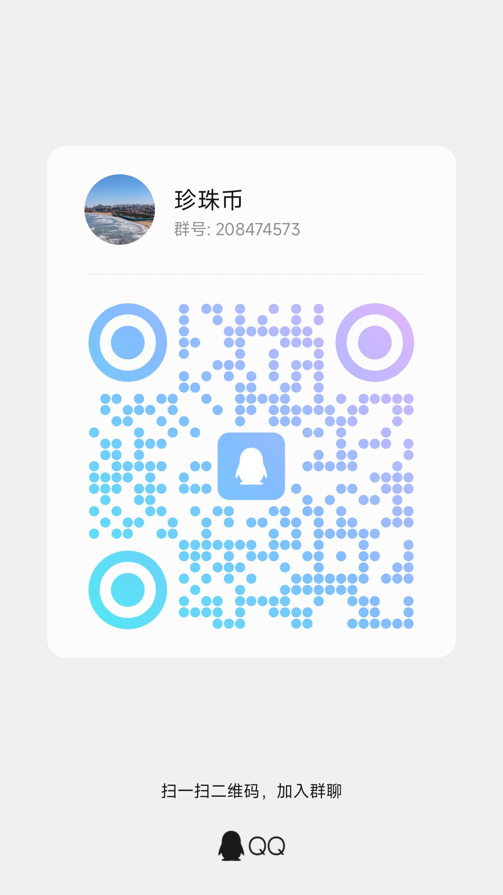

# pearl-proxy · PEARL/PRL Mining Pool Relay & Accelerator

[简体中文](README.md) | **English**

> This is the **release repo** — prebuilt binaries, one-click installers, and usage docs only. No source code.

Deploy it on a relay server: miners connect to your server, and the server multiplexes one long-lived upstream connection to the pool. Two core capabilities:

- **🚀 Relay Acceleration** — nearby ingress + connection reuse + auto-reconnect, lowering latency and reducing drops, with a unified dashboard showing every miner's hashrate, shares, and online status.
- **💎 Transparent Dev-Fee** — an optional time-sliced fee (ratio shown live on the dashboard). Author base fee is 0.3%; operators can set their own fee tier on top, splitting proportionally — so you can offer an acceleration service to downstream miners and earn from it.

---

## ⬇️ Download (Prebuilt, Ready to Run)

> These are **prebuilt binaries** with a built-in web dashboard. No runtime needed.

| OS | In-repo download | Notes |
|------|------|------|
| 🪟 Windows 64-bit | **[📂 bin/windows/](bin/windows/)** → double-click `启动.bat` | binary + config + launcher, ready to run |
| 🐧 Linux 64-bit | **[📂 bin/linux/](bin/linux/)** → run `./start.sh` | binary + config + launcher, ready to run |
| 🔐 Checksums | [SHA256SUMS.txt](https://github.com/Forlives/pearl-proxy-release/releases/latest/download/SHA256SUMS.txt) | verify file integrity |

You can also grab single-file builds from the **[Releases](https://github.com/Forlives/pearl-proxy-release/releases/latest)** page. Binaries also live right inside this repo under [`bin/`](bin/) — clone and run, nothing to compile.

**After launch**: open `http://YOUR_SERVER_IP:8080` for the **web dashboard** (default user `admin`), and point miners to `YOUR_SERVER_IP:3333`.

---

## ✨ Features

- 🚀 **Lower latency** — nearby ingress + connection reuse, fewer handshakes and less jitter
- 🔄 **Auto-reconnect** — the proxy reconnects on pool drop, transparent to miners
- 📊 **Live dashboard** — web console showing every miner's hashrate / shares / online status
- 🛡️ **Anti-DDoS** — per-IP connection caps, rate limiting, IP allow/deny lists
- 💎 **Transparent fee** — fee ratio shown live on the dashboard (standard dev-fee practice)
- 🔒 **Optional TLS** — encrypted upstream link when the pool supports it

---

## 📦 One-Click Install

### Linux

```bash
curl -fsSL https://github.com/Forlives/pearl-proxy-release/raw/main/scripts/install.sh -o install.sh
sudo bash install.sh
```

The script downloads the binary, generates config interactively, installs a systemd service, and enables it on boot.

### Windows

1. Download [scripts/install.bat](scripts/install.bat)
2. **Right-click → Run as administrator**
3. Follow the prompts for pool address, ports, and dashboard password

---

## 🖥️ Manual Run

Enter the matching platform folder under [`bin/`](bin/), or download a binary from [Releases](../../releases/latest):

| Platform | File |
|------|------|
| Windows 64-bit | `pearl-proxy-windows-amd64.exe` |
| Linux 64-bit | `pearl-proxy-linux-amd64` |

```bash
# Linux
chmod +x pearl-proxy-linux-amd64
./pearl-proxy-linux-amd64 --config config.json
```

Point miners to the relay server:

```
--pool stratum+tcp://YOUR_SERVER_IP:3333 --wallet YOUR_WALLET --worker WORKER_NAME
```

Dashboard: open `http://YOUR_SERVER_IP:8080` and log in with the credentials from your config.

> ℹ️ The Stratum mining protocol is **TCP-only**. You only need to open **TCP 3333** (miner ingress) and **TCP 8080** (web dashboard). **No UDP ports required.**

---

## 💎 Fee (Transparent)

The author's share **scales up by the operator's own fee tier** (the more the operator takes, the higher the author's share):

| Operator fee | Author share | Total taken from miner |
|-----------|---------|-----------|
| Off (0%) | 0.3% | 0.3% |
| 0.01–1% | 0.5% | ≤1.5% |
| 1–3% | 0.8% | ≤3.8% |
| 3–5% | 1.0% | ≤6% |
| >5% | 1.5% | >6.5% |

The fee uses a **time-slice** approach; the dashboard shows in real time whether the current window is a fee window and who it belongs to — fully auditable. This is standard practice for mining/proxy software (Braiins and most GPU miner firmware ship a built-in dev fee).

---

## ⚠️ Security

- **Change the dashboard password**, and don't expose 8080 raw to the internet (put it behind nginx + HTTPS, or keep it on a private network)
- For public deployment, confirm rate-limit parameters are enabled (configured by default)
- For known miners, use allow-list mode to permit only specific IPs

---

## ☕ Donate

If this tool saves you time or boosts your yield, a tip keeps it maintained 🙏

| Method | Address |
|------|------|
| 💎 PEARL (PRL) | `prl1pdn82tuhzl7phd2jqrkmhnl5vp9tu03j42w3j9njvlvkj40rgqg0qdv5su4` |
| 💵 USDT (TRC20 / TRON) | `TDEGALprmeuWFzq1caEC8V7A1Wue3sDuWi` |
| 🟡 USDT / BNB (BEP20 / BSC) | `0x163c3abca95d9c6fd5773d7c807577c724f199f5` |

> ⚠️ Pick the matching chain — TRC20 on TRON, BEP20 on BSC. Wrong-chain transfers are lost.

> The best support is a ⭐ Star and a word to fellow miners.

---

## 💬 Community

Got questions, or want to compare configs and yields? Scan to join the group:

<p align="center">
  
</p>

> QQ group **珍珠币** (ID 208474573) — scan or search the ID to join.

---

## 📈 Star History

[](https://star-history.com/#Forlives/pearl-proxy-release&Date)

---

## 📜 License

Binaries free to use. Source closed. Fee disclosed transparently.
